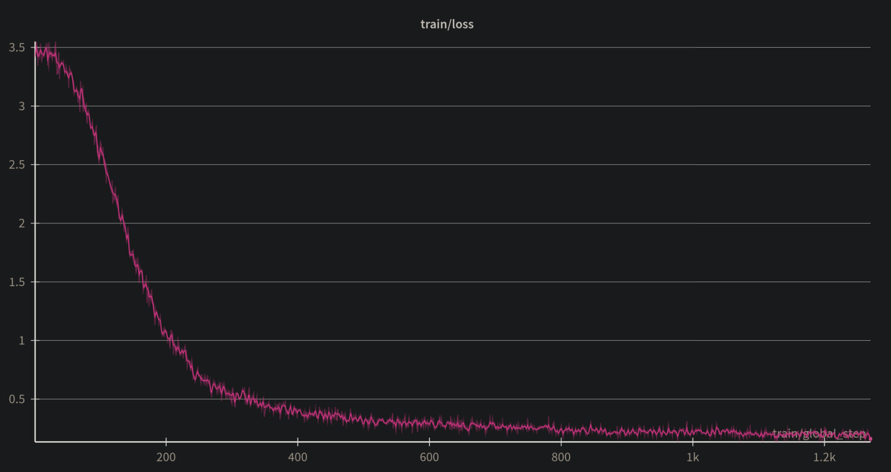
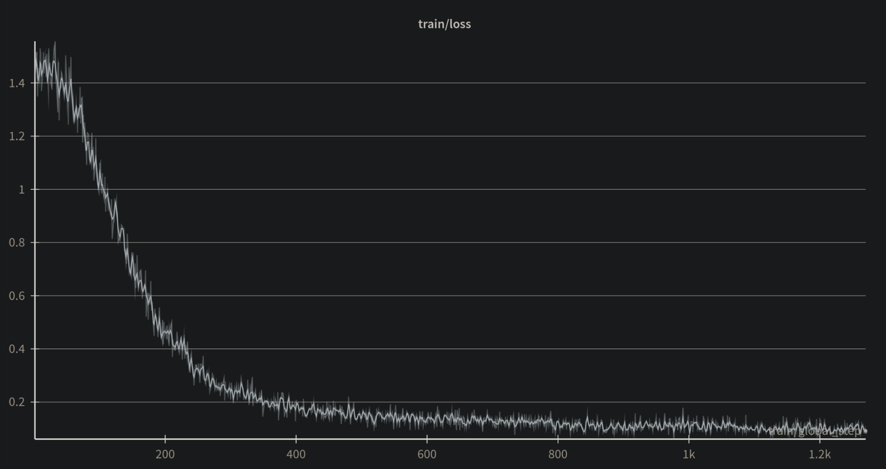

# QAT results with Unsloth

I finetuned the model `google/embeddinggemma-300m-qat-q8_0-unquantized`

Training params:

```python
EPOCHS = 0.5
args = SentenceTransformerTrainingArguments(
    output_dir=f"embeddinggemma_{RUN}",
    num_train_epochs=EPOCHS,
    per_device_train_batch_size=300,
    learning_rate=3e-6,
    fp16=not torch.cuda.is_bf16_supported(),
    bf16=torch.cuda.is_bf16_supported(),
    logging_steps=1,
    warmup_steps=100,
    save_strategy="steps",
    save_steps=500,
    report_to="wandb",
    weight_decay=0.01,
    lr_scheduler_type="cosine_with_restarts",
    lr_scheduler_kwargs={"num_cycles": EPOCHS},
)
```

Half an epoch = approximately 400k rows, it was the same dataset as this model: https://huggingface.co/electroglyph/FictionBert

I did 2 runs, one with "int8" QAT scheme and one without

Loss curve with QAT (final loss = 0.1509):


Loss curve without QAT (final loss = 0.0869):



Definitely seems to slow down convergence a bit, but not a huge deal.

QAT needs slightly higher LR or maybe 100k extra rows to reach similar loss.

## Benchmark results

I have a custom benchmark for that dataset (based on withheld data) which is approximately 5% of each book in the dataset, with hard negatives added in.

(The negatives aren't super hard, I'll probably make an improved version)

Before finetuning, the base model achieves 95.66%

### non-QAT

Finetuned non-QAT model achieves 98.38%

int8 quantized version of non-QAT model achieves 98.06%

Variance = 0.32%

Unquantized:

```
{
    "model": "/home/anon/embedding_notebook/non_qat_16bit",
    "timestamp": "2026-01-08T03:24:41.247593",
    "dataset": "test.jsonl",
    "num_records": 39750,
    "accuracy_at_1": 0.9838238993710692,
    "mrr": 0.9915979035639414,
    "mean_positive_sim": 0.5992372371265723,
    "mean_margin": 0.2406107189250442,
    "rank_distribution": {
      "1": 39107,
      "2": 576,
      "3": 53,
      "4": 11,
      "5": 3,
      "6": 0,
    },
    "total_time_minutes": 16.84756801525752,
    "avg_iterations_per_second": 39.32318298997374
  }
```

The ONNX ones run slower because they're on CPU:

```
{
    "model": "nonqat_onnx_embeddinggemma",
    "timestamp": "2026-01-08T09:37:16.055483",
    "dataset": "test.jsonl",
    "num_records": 39750,
    "accuracy_at_1": 0.9806792452830189,
    "mrr": 0.9900377358490566,
    "mean_positive_sim": 0.5859390643293377,
    "mean_margin": 0.23079555337972144,
    "rank_distribution": {
      "1": 38982,
      "2": 704,
      "3": 51,
      "4": 8,
      "5": 5,
      "6": 0,
    },
    "total_time_minutes": 135.08852970600128,
    "avg_iterations_per_second": 4.904191358376806
  }
```

### QAT

Finetuned non-QAT model achieves 97.56%

int8 quantized version of QAT model achieves 97.53%

Variance = 0.03%

Unquantized:

```
{
    "model": "/home/anon/embedding_notebook/qat_16bit",
    "timestamp": "2026-01-08T13:35:51.325314",
    "dataset": "test.jsonl",
    "num_records": 39750,
    "accuracy_at_1": 0.9756729559748427,
    "mrr": 0.9873735849056603,
    "mean_positive_sim": 0.5727654886478148,
    "mean_margin": 0.17481996631088123,
    "rank_distribution": {
      "1": 38783,
      "2": 866,
      "3": 85,
      "4": 12,
      "5": 3,
      "6": 1,
    },
    "total_time_minutes": 19.411079382896425,
    "avg_iterations_per_second": 34.12999282171526
  }
```

ONNX:

```
{
    "model": "qat_onnx_embeddinggemma",
    "timestamp": "2026-01-08T07:22:09.225587",
    "dataset": "test.jsonl",
    "num_records": 39750,
    "accuracy_at_1": 0.9753459119496856,
    "mrr": 0.9872046121593291,
    "mean_positive_sim": 0.5642072389999275,
    "mean_margin": 0.16793714882480273,
    "rank_distribution": {
      "1": 38770,
      "2": 880,
      "3": 80,
      "4": 15,
      "5": 4,
      "6": 1,
    },
    "total_time_minutes": 137.50870520273844,
    "avg_iterations_per_second": 4.817876795677998
  },
```

## Cosine drift results

For the final test I compared cosine similarity of vectors from each finetuned 16 bit model to their corresponding int8 quantized version.

I used the first 1000 entries of this dataset: https://huggingface.co/datasets/stanfordnlp/imdb

### Non-QAT, unquantized vs. int8

```
Min Similarity : 0.764286
Max Similarity : 0.985385
Mean Similarity: 0.963609
Mean Distance  : 0.036391
```

### QAT, unquantized vs. int8

```
Min Similarity : 0.809801
Max Similarity : 0.988582
Mean Similarity: 0.967978
Mean Distance  : 0.032022
```

Overall, cosine similarity is still pretty close for both of the quantized models, however the QAT has drifted less from it's unquantized parent.

## Quantization

To quantize I used full precision exports of both models. I did *not* use save_pretrained_torchao() for the QAT model because I wanted to quantize both models the same way.

I converted both models to ONNX format, and then quantized to int8.

Quantization params:

```python
quantizer = ONNXQuantizer(
        model,
        per_channel = True,
        reduce_range = False,
        mode=QuantizationMode.IntegerOps,
        static=False,
        weight_qType=QuantType.QInt8,
        activation_qType=QuantType.QUInt8, # this model seems okay with this
        extra_options=dict(
            EnableSubgraph=True, 
            MatMulConstBOnly=True # only quantize matmuls where B is constant
        ), 
    )
```
